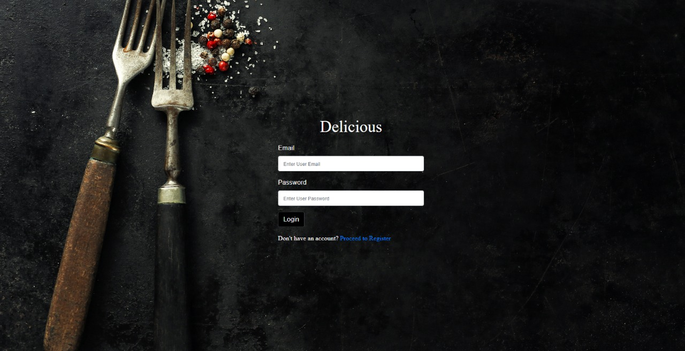

<h1> Restaurant Management System🍴 </h1>

This project is a fully developed Restaurant Management System website that provides an all-in-one solution for managing restaurant operations. The website features an intuitive interface for customers to browse menus, place orders, make reservations, and leave feedback. On the admin side, restaurant managers can efficiently manage inventory, staff, and view sales analytics through a dedicated dashboard. A secure payment gateway has been integrated to ensure smooth transactions, along with an analytics panel for performance insights. By combining these functionalities, the system enhances operational efficiency and delivers a seamless dining experience for users.

 


## Features
### Customer Side
- Interactive menu display with categorized items
- User authentication and profile management
- Points-based membership system with VIP status
- Restaurant information and contact details
- Operating hours display
- Reservation system

### Admin Side
- Staff login system
- Menu management
- Order processing
- Reservation management
- Customer data management

## Technologies Used
- PHP
- MySQL
- HTML5
- CSS3
- JavaScript
- jQuery
- Bootstrap

## Setup Instructions

1. Clone the repository
2. Set up a local web server (e.g., XAMPP, WAMP)
3. Import the database schema
4. Configure the database connection in `config.php`
5. Access the application through your web browser

## Project Structure
```
RestaurantProject/
├── adminSide/         # Admin interface files
├── customerSide/      # Customer interface files
│   ├── home/         # Homepage and main navigation
│   ├── css/          # Stylesheets
│   ├── js/           # JavaScript files
│   └── image/        # Image assets
└── index.php         # Entry point
```

## Requirements
- PHP 7.0 or higher
- MySQL 5.7 or higher
- Web server (Apache/Nginx)

## Contributing
Feel free to fork this project and submit pull requests for any improvements.

## License
This project is licensed under the MIT License - see the LICENSE file for details. 
